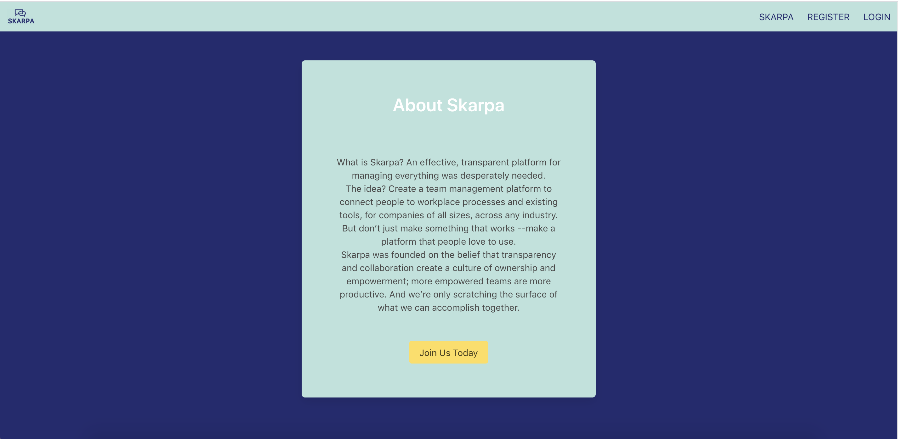
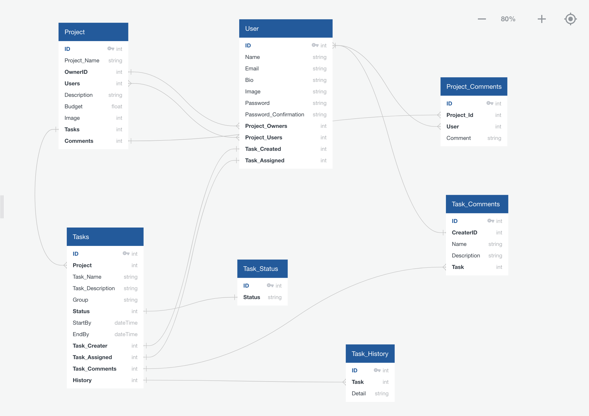
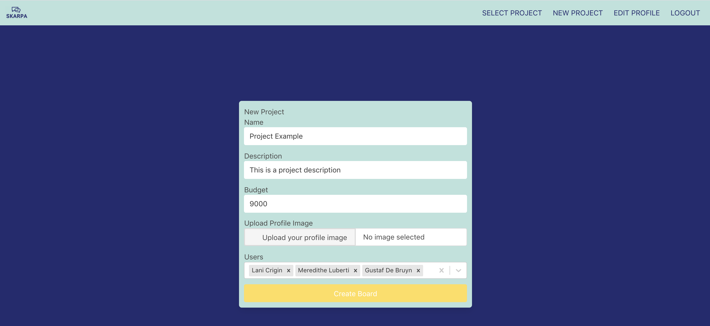
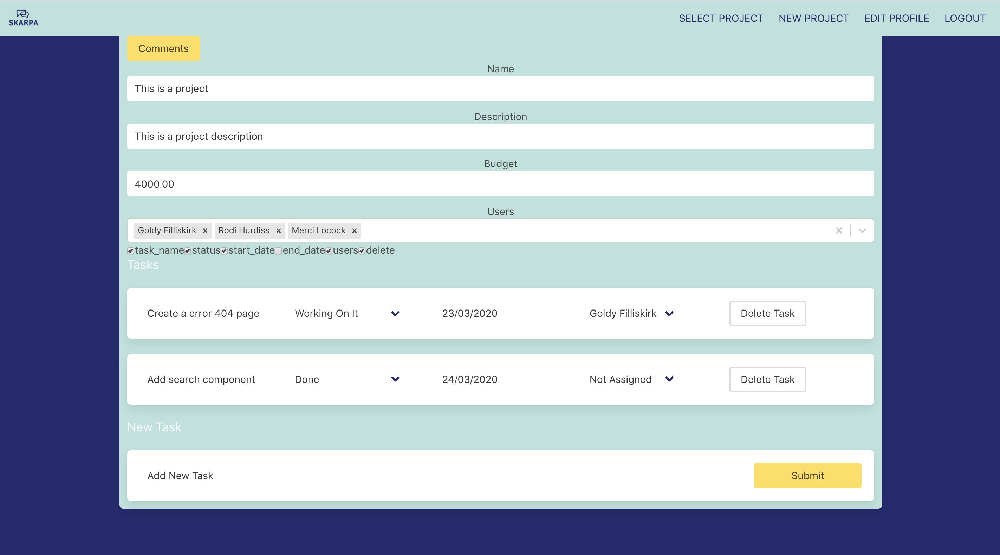
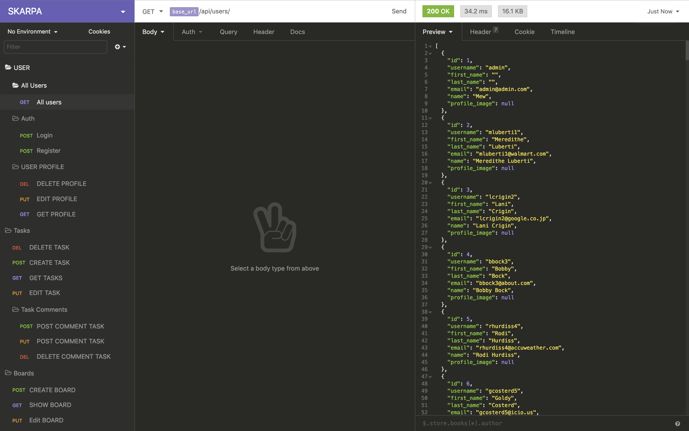

# Software Engineering Immersive – Project 04

This was the fourth and final project on the General Assembly Software Engineering Immersive. It was a solo project which took place over 7 days.

# Skarpa: Project Management Tool

Skarpa is a project management app based off of Monday.com. The user can register, login, create a board, add tasks, comment on the board and manage tasks.

## Brief

    - Build a full-stack application with backend and front-end using Django with PostgresQL and ReactJS.

    - Work with at least 3 models, incorporating nested or populated serializers / one-to-one and manay-to many models

    - Incorporate CRUD funtionality 

    - Establish a user journey and wireframes that clearly show which elements are MVP (CRUD fucntionality) and which elements are bonus features

    - Deploy the project online 



## Deployment 

The project is deployed online with Heroku and can be found here:

https://skarpa-project-management-tool.herokuapp.com/

## Getting started

Use the clone button to download the source code. Enter the following commands in the CLI: 

```
<!— To install all the packages listed in the package.json: —> $ yarn 

<!- Navigate into the shell -> $ pipenv shell

<!— Run the app on localhost:4000 : —> $ yarn serve:back 

<!— Check the console for any issues and if there are any then check the package.json for any dependancies missing —>

<!- Navigate to http://localhost:4000/>
```

## Technologies Used:

1. HTML5
2. Bulma
3. Javascript
   * ECMAScript6
   * React.js
4. SQL
   * PostgresQL
   * Django
   * Python
5. Testing
   * Manual: Insomnia
5. GitHub
6. Cloudinary
7. Axios

## Planning Process

As this was my first time using a SQL database, I wanted to be as clear as possible with how each model connects with another. This was extremely important as my task model has a relationship with 5 other models.

I found quickdatabasediagrams.com and built a schema to easily visualise how each model has a relationship with each other.



## User Experience 

Skarpa is a project management tool developed to be a clone of Monday.com. A user can add projects known as boards, tasks within those boards and assign users to boards and tasks.



With full CRUD functionality, the user also has the ability to register, login, create a project, edit project and add, edit and delete tasks within projects.

The user has to be logged in and can only see and edit boards that are a memeber of.



Above is an image of a board in Skarpa. The user has three others assigned to the board and two tasks that have been created.

The below is a code snippet from the user multiple selete component. This was created when the board component did mount and the data was passed as a prop to both the board commponent and then each tasks component.

```JavaScript
    try {
      const res = await axios.get('/api/users/', {
        headers: { Authorization: `Bearer ${Auth.getToken()}` }
      })
      const users = res.data.map(user => (
        { value: user.id, label: user.name }
      ))
      const defaultUser = users.filter(user =>(
        this.state.board.users.indexOf(user.value) !== -1 || this.state.board.owner == user.value
      ))       
      this.setState({ users, defaultUser })
    } catch (err) {
      console.log(err)
    }
  ```

Pulling all users meant we could us a multi-select to add new users to the board.

  ```jsx
<div className="field">
        <label className="form-fields">Users</label>
        <div className="control">        
          <Select
            options={users}
            value={defaultUser}        
            isMulti          
            onChange={(e) => handleMultiChange(e)}
            onBlur={handleSubmit}
          />
        </div>
      </div>
```

When this was changed in state it would be pushed as a prop to each task on the board that would be able to change the user assigned to task dropdown

```jsx
<option value={null}>Not Assigned</option>            
  {this.props.users.map(user => (
<option value={user.value}>{user.label}</option>
  )))}
```

As shown in the schema, the hardest task in the backend was the tasks model. Four model had a relationship with the task model and due to this planning was nessessary. Without using quickdatabasediagrams.com to visualise the relationships I would of had to redo this model as I hadn't realised users would be a many to many relationship.

```python
  class Task(models.Model):
    task_name = models.CharField(max_length=50)
    task_description = models.CharField(max_length=500, null=True)
    start_date = models.DateField(null=True)
    end_date = models.DateField(null=True)
    group = models.CharField(max_length=50, null=True)
    status = models.ForeignKey(Task_Status, related_name='task', on_delete=models.SET_NULL, null=True)
    board = models.ForeignKey(Board, related_name='board_task', null=False, on_delete=models.CASCADE, default=1)  
    owner = models.ForeignKey(User, related_name='task_owned', null=False, on_delete=models.CASCADE, default=1)
    users = models.ManyToManyField(User, related_name='task_assigned', blank=True)
```


## Create testing in Insomnia 

 
   
Due to time constrants I wasn't able to learn and test using Django's build in testing framework. Instead, I used Insomia to get through every API call as it was built and check the following:

* Sending a blank response do I get a response?
* Do I get the correct response?
* Do I get the correct data and only what information I need?
* Can I access the data without authentication?
* Can I access the data with the wrong authentication?
* Do I get the correct response when sending no JSON data?
* Do I get the correct response when sending the wrong JSON data?
* Do I get the correct data authentication and JSON are correct?

By doing this I discovered:

* User API was sending too much information and need to be serialized.
* Users of other boards could add comments.
* Register needed better validation as none emails could be added to email


## Reflection and Future improvements 

Overall, I was pleased with the outcome of my project. I had planned a SQL backend and knew how every model would connect with each other. There were no referencing circles or issue with nested serializers. 

I have leart a lot but I am now more aware of my own limitations. I had too many plans and ideas for a one person person with a 7 day time limit. In the end I had to scrape some of the backend to focus on making that I did have on the frontend work in all situations.

I would have liked to implement testing for both the Django backend and the React frontend, to build on what I had done in terms of back end development testing in Insomnia. 

There are 7 models in my backend but not all of them made it into the frontend of the project. I had an ambitous plan and did not factor a bluffer for issues that could occur. It is due to this that task history is missing, task comments are missing and 